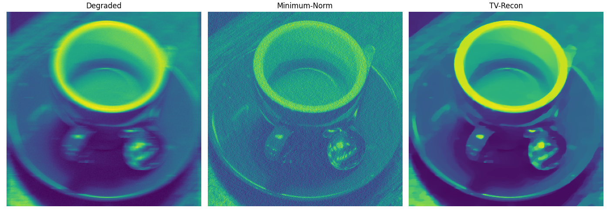
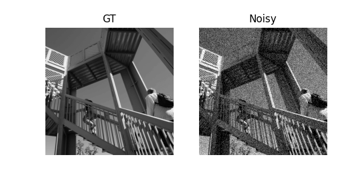
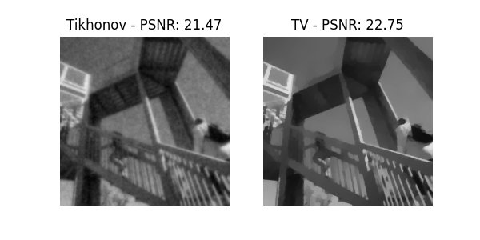
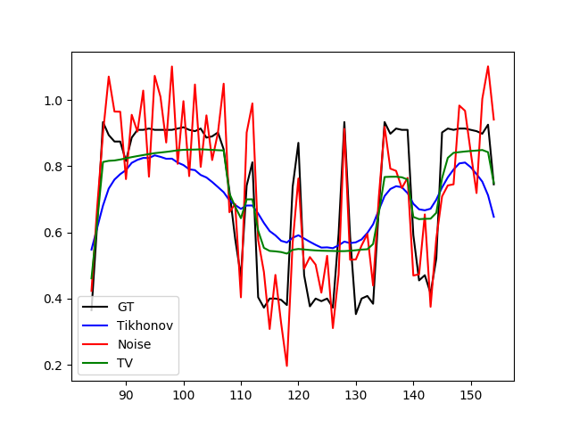
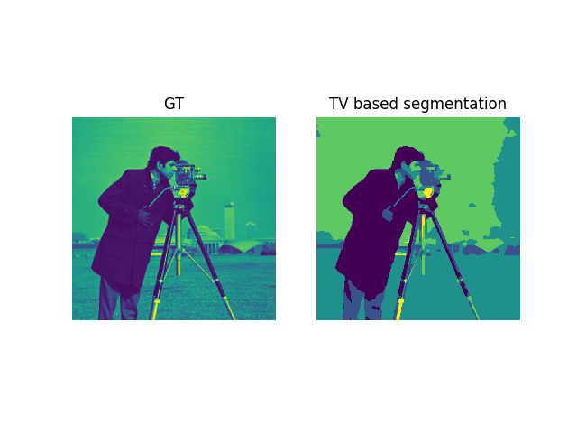

# Recon

A python-based toolbox for solving regularized Inverse Problems using Primal-Dual algorithms. 
The project provides an overview of solving regularization problems and is the result of a master's thesis. 
Build as proof of concept.

## Overview

* Reconstruction, Smoothing 
* class-based Segmentation
* Spatially Adapted Regularization
* Bregman-Iteration
* Denoising, Deconvolution, Computerized Tomography


## Reconstruction
In terms of Inverse Problems one is interested in the reason 

of measurment data 

with regard to a forward map 
.
Due to the fact of measurement inaccuracies, regularization terms 

are added and the optimization problem is maintained as
<p align="center">

 <p/>
 
 ```python
import numpy as np

from recon.operator.ct_radon import CtRt
from recon.interfaces import Recon
from matplotlib.image import imread

gt = imread("../data/phantom.png")
gt = gt/np.max(gt)

theta = np.linspace(0, 180, 180, endpoint=False)
sigma = 0.01
R = CtRt(gt.shape, center=[gt.shape[0]//2, gt.shape[1]//2], theta=theta)

y = R*gt.ravel()

rec = Recon(operator=R, domain_shape=gt.shape, reg_mode='tv', alpha=1, lam=15, extend_pdhgm=True)
x_tv = rec.solve(data=y.ravel(), max_iter=1000, tol=1e-4)
 ```

Imaging result for another inverse problem where 

is a convolution operator:

 <p align="center">
 
 </p>

## Denoising
Image denoising is a special case of regularized reconstruction.
<p align="center">

 <p/>
 
  ```python
import numpy as np
from scipy import misc
from recon.interfaces import Smoothing

img = misc.ascent()
gt = img/np.max(img)
sigma = 0.2
n = sigma*np.max(gt.ravel()*np.random.uniform(-1, 1, gt.shape))
noise_img = gt + n
 
tv_smoothing = Smoothing(domain_shape=gt.shape, reg_mode='tv', lam=10, tau='calc')
u0 = tv_smoothing.solve(data=noise_img, maxiter=1500, tol=10**(-4))
 ```
 
 <table>
  <tr>
    <td></td>
    <td></td>
    </td>
  </tr>
 </table>
 <p align="center">
 
 </p>

## Segmentation
Some segmentation methods are implemented as part of regularization approaches and performance measurements.
Through a piecewise constant TV-solution, one quickly obtains a suitable segmentation.
  ```python
import skimage.data as skd
import numpy as np

from recon.interfaces import Segmentation

gt = rgb2gray(skd.coffee())[:,80:481]
gt = gt/np.max(gt)
gt = gt/np.max(gt)

classes = [0, 50/255, 120/255, 190/255, 220/255]

segmentation = Segmentation(gt.shape, classes=classes, lam=5, tau='calc')
result, _ = segmentation.solve(gt, max_iter=4000)
 ```

 <p align="center">
 
 </p>
  
  ## References
  1. The Repo based on [Enhancing joint reconstruction and segmentation with non-convex Bregman iteration](https://iopscience.iop.org/article/10.1088/1361-6420/ab0b77/pdf) - Veronica Corona et al 2019 Inverse Problems 35, and their code on [GitHub](https://github.com/veronicacorona/JointReconstructionSegmentation).
  1. To outsource operator handling [PyLops](https://github.com/equinor/pylops) package is used.
  1. Efficient Radon operator [Astra Toolbox](https://www.astra-toolbox.com).
